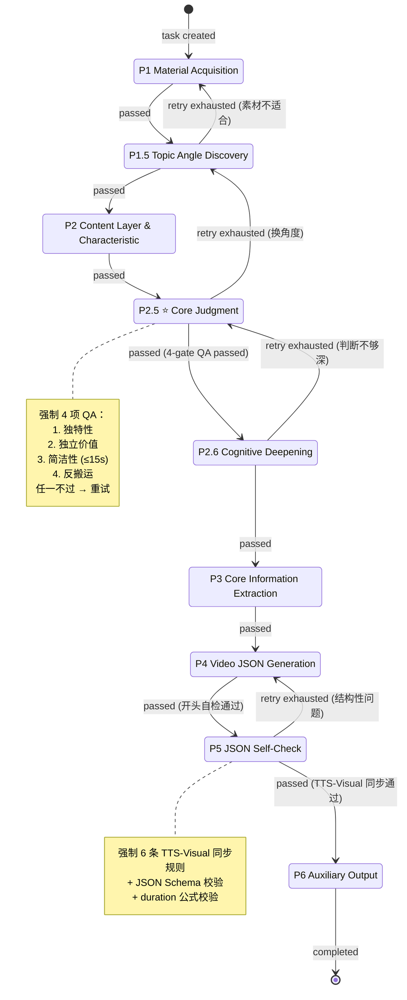

# LLM-X Advocate Agent — 规格说明书 v0.1

> **本文档目标**：把 `docs/source-skill/` 里那套已经验证有效的 SOP，翻译成一个可被工程系统执行的、可被人类干预的、可被回归测试的 agent 规格。
>
> 阅读顺序：先看 §1 形式化定义，再看 §2 状态机，§3 数据模型，§4 接口，§5 质检关卡的强制执行机制。
>
> **本文档不挑技术栈**——技术栈候选见 `docs/architecture-options.md`。

---

## 1. Agent 的形式化定义

### 1.1 核心契约

整个 agent 是一个**带强制质检关卡的有向状态机**。每个 phase 是一个 node，有以下 5 元组定义：

```
Phase = (id, inputs, outputs, qa_gates, transition_rules)
```

- **inputs**：从前序 phase 的产出 + 任务全局上下文中读取
- **outputs**：本 phase 的产出（结构化数据，不是自由文本）
- **qa_gates**：通过/失败二值判断的质检规则集合（独立可执行、可重跑）
- **transition_rules**：当前 phase 完成后，根据 qa_gates 结果决定推进/重试/回退

> **核心不变量**：`qa_gates` 不是文档里的"建议"，是引擎执行时的**强制门禁**。任何未通过的关卡都阻塞下一 phase 启动。

### 1.2 Phase 全集

| ID | 名称 | 输入 | 主要产出 | 强制质检 |
|----|------|------|----------|----------|
| P1 | **Source Pack Loading & Validation** | `SourceInput`（pack_path 或 pack_content） | `SourcePack`（schema v1.0；frontmatter + body_markdown，详见 [docs/source-pack-schema.md](source-pack-schema.md)） | schema 校验通过；body 非空。**失败不重试**（输入数据问题，重试无意义）|
| P1.5 | Topic Angle Discovery | SourcePack | `Angle`（hook_source / core_tension / your_position / why_readers_care） | 至少 1 条社区讨论已检索（可来自 pack body 的"评论区精华"段或 controversy_signals）；找到的 angle 不是"产品发布通报" |
| P2 | Content Layer & Characteristic | SourcePack + Angle | `LayerProfile`（tier ∈ 引流/留存/转化, 6维特性评分, 目标时长, 目标 scene 数, export_formats） | tier 已确定；6维特性表完整。**优先采纳** `scout_analysis.suggested_layer`，可推翻 |
| **P2.5** | ⭐ **Core Judgment Extraction** | SourcePack + Angle + LayerProfile + （`scout_analysis.judgment_seed` 如果存在） | `Judgment`（surface / transition / deeper_essence / full_sentence + `seed_judgment` / `overrode_seed` / `override_reason`） | **强制 4 项 QA**（§5.1）。即使沿用种子也照过 4 项 QA |
| P2.6 | Cognitive Deepening | Judgment + SourcePack | `DeepThinking`（why_round, meaning_round, judgment_validation） | 4 项 Depth Test（§5.2） |
| P3 | Core Information Extraction | SourcePack + Judgment + DeepThinking | `CoreInfo`（3-5 findings, key_data, stories, advocate_interpretation） | findings ≥ 3 且 ≤ 5；每条 finding 有数据/出处；**5 维素材丰富度 ≥ 3**（§5.6） |
| P4 | Video JSON Generation | 全部上游产出 + LayerProfile.tier + `opening_style` | `VideoJSON`（完整 scenes 数组）+ `OpeningStrategy`（选择的开头模式 A-F） | **开头自检按 opening_style 分叉**（§5.3）+ scene 数符合 tier 范围 |
| P5 | JSON Self-Check | VideoJSON | `ValidationReport`（语法/同步/时长/完整性/AI 味） | **JSON Schema 校验** + **6 条 TTS-Visual 同步规则**（§5.4）+ **anti-AI 味检测**（§5.5）|
| P6 | Auxiliary Output | VideoJSON + Judgment + LayerProfile | `Publishing`（标题×2-3、简介、时间戳） | 标题体现判断；标题风格匹配 tier |

#### 1.2.1 可选 Phase（V0.1 不实现，规格预留扩展点）

| ID | 名称 | 触发条件 | 简介 |
|----|------|---------|------|
| P0 | Topic Validation | `TaskConfig.enable_topic_validation=true` | 选题预诊断：内容形式匹配 + 是否值得做（来源 dbs-content Phase 1-2）。LE PPW 自用默认关；对外开放时启用 |
| P7 | Commercial Alignment | `TaskConfig.enable_commercial_alignment=true` | 商业化对齐：选题是否服务付费产品、是否对齐高利润标准（来源 dbs-content + dbs-benchmark + dbs-diagnosis） |

### 1.3 失败语义

每个 phase 的执行可能落入下面 4 种状态之一，引擎据此决定下一步：

| 状态 | 含义 | 推进规则 |
|------|------|---------|
| `passed` | 产出完成 + 全部 QA 通过 | 推进到下一 phase |
| `qa_failed` | 产出完成但 QA 未过 | 同 phase 重试，重试次数有上限（默认 3） |
| `qa_failed_terminal` | 重试上限耗尽 | 强制回退到指定上游 phase（每个 phase 在规格里写死回退目标） |
| `error` | 工具/模型/网络错误 | 同 phase 重试；不计入 QA 重试计数 |

**回退表**（写死在引擎里，不是运行时决策）：

| 当前 phase | 回退目标 | 触发原因 |
|-----------|---------|---------|
| P1.5 重试耗尽 | P1 | 原始素材本身可能不适合做 |
| P2.5 重试耗尽 | P1.5 | 找不到强判断 → 这个角度不行，换角度 |
| P2.6 重试耗尽 | P2.5 | 判断本身不够深，需要重新提取 |
| P3 重试耗尽 | P2 | 多半是 topic_breadth 失败 → tier 选错（如垂直技术帖判成留存层，应回 P2 重判为转化层） |
| P4 开头自检耗尽 | P4 内部子步骤（不离开 phase） | 仅重写开头，不重做正文 |
| P5 同步检查耗尽 | P4 | JSON 结构问题，需要重新生成 |

---

## 2. 状态机图



### 2.1 暂停 / 人工接管

任何 phase 完成后（无论 passed 还是 qa_failed），任务都可以转入 `paused_for_human` 状态：

- 引擎不自动推进
- 用户可通过 CLI/Web 修改任意 phase 的产出
- 修改后必须执行 `task qa <id> <phase>` 重跑该 phase 的质检
- 重跑通过才能 `task resume`

人工修改的产出**永远**会被打上 `edited_by_human=true` 标记，质检关卡仍然必须通过——人工不能跳过质检，只能修改产出来满足质检。

---

## 3. 数据模型

下面是逻辑模型（不绑死任何 ORM/Schema）。每个实体的字段是契约，存储介质由 architecture 文档决定。

### 3.1 Task（任务）

```
Task {
  id: string                    // ULID，对人类可读的短 ID
  title: string                 // 用户可改，初始从 source 推断
  source: SourceInput           // 见 3.2
  config: TaskConfig            // 见 3.3
  current_phase: PhaseId        // 当前停留的 phase
  status: TaskStatus            // running | paused_for_human | completed | failed
  created_at: timestamp
  updated_at: timestamp
}
```

### 3.2 SourceInput

> **V0.2 起架构调整**：抓取 URL / PDF / 搜话题的能力已**移出**本项目，归入未来的 `llmx-scout-agent`。advocate-agent 只消费**source pack 文件**——一个 markdown + YAML frontmatter 文件，schema 见 [docs/source-pack-schema.md](source-pack-schema.md)。

```
SourceInput {
  pack_path?: string            // 本地 pack 文件路径
  pack_content?: string         // 直接传入 pack 文本（API 上传场景）
}
```

任何抓取 URL / 解析 PDF / 搜话题的需求 → 由 scout-agent 处理（V0.1 阶段 scout 不存在，用户手工写 pack）。

### 3.3 TaskConfig（创建任务时确定，可改）

```
TaskConfig {
  target_audience: "学生" | "从业者" | "决策者"   // 默认决策者
  target_tier: "引流" | "留存" | "转化" | "auto"  // auto 由 P2 决定
  export_formats: list<"landscape"|"portrait"|"square"> | "auto"
  
  // 开头风格（从单一红线降级为可配置实验维度，详见 §5.3）
  opening_style: "judgment_first" | "suspense_first" | "auto" = "auto"
                  // auto 默认：引流→suspense_first，留存/转化→judgment_first
  
  // LLM 配置
  llm_provider: "anthropic" | "openrouter"
  llm_model: string                                  // e.g. "claude-opus-4-7", "deepseek/deepseek-v4-pro"
  
  // 重试上限（按 phase 分别配置，详见 §5.7）
  qa_max_retries: dict<PhaseId, int> = DEFAULT_RETRIES
  
  // 可选 phase 开关
  enable_topic_validation: bool = false       // P0
  enable_commercial_alignment: bool = false   // P7
}
```

### 3.4 PhaseRun（每次 phase 执行的记录，append-only）

```
PhaseRun {
  id: string
  task_id: string
  phase_id: PhaseId             // P1, P1.5, P2, P2.5, ...
  attempt: int                  // 第几次重试（1-based）
  trigger: "auto" | "manual_resume" | "manual_qa_rerun"
  llm_provider: string          // 这次跑用的是哪个 provider
  llm_model: string             // 跑用的哪个 model（用于事后做 A/B）
  
  output: PhaseOutput           // 见 3.5
  qa_result: QAResult           // 见 3.6
  status: "passed" | "qa_failed" | "qa_failed_terminal" | "error"
  
  edited_by_human: bool         // 这一版是否经过人工修改
  edit_note?: string            // 人工修改时的备注
  
  cost: TokenUsage              // 输入/输出 token 计数 + 估算成本
  duration_ms: int
  
  started_at: timestamp
  finished_at: timestamp
}
```

### 3.5 PhaseOutput（多态，按 phase 不同）

```
PhaseOutput = 
  | RawMaterial { full_text, source_metadata, fetched_at }
  | Angle { hook_source, core_tension, your_position, why_readers_care }
  | LayerProfile { tier, characteristic_scores, target_duration_seconds, target_scene_count, export_formats }
  | Judgment { surface, transition, deeper_essence, full_sentence }
  | DeepThinking { why_round, meaning_round, validation_notes }
  | CoreInfo { findings, key_data_points, stories, advocate_interpretation }
  | VideoJSON { export_formats, scenes }       // 完整 JSON，符合 §5.4 中的 schema
  | ValidationReport { syntax_ok, sync_warnings, duration_total, tts_total_chars, ... }
  | Publishing { titles, description, pinned_comment }
```

### 3.6 QAResult

```
QAResult {
  gates: list<{
    gate_id: string             // e.g. "P2.5_uniqueness"
    name: string                // 人类可读
    passed: bool
    rationale: string           // LLM 自评 + 规则的解释
    evidence?: any              // 触发该判断的具体证据（如违规文本）
  }>
  passed_overall: bool          // = all(gates.passed)
}
```

### 3.7 HumanEdit（人工修改痕迹，append-only）

```
HumanEdit {
  id: string
  task_id: string
  phase_id: PhaseId
  before: PhaseOutput
  after: PhaseOutput
  reason: string                // 用户填的修改理由
  edited_at: timestamp
}
```

> **设计原则**：所有产出**永不就地覆盖**。每次重试或人工修改都产生新的 `PhaseRun`/`HumanEdit` 记录，旧版本永远可回溯。同一 phase 当前生效的版本由 "最新 status=passed 的 PhaseRun" 决定。

---

## 4. 接口

### 4.1 CLI 命令清单（V0.1 主战场）

> 命令名仅作示意，最终命名以技术方案为准。

| 命令 | 说明 |
|------|------|
| `task new <source>` | 创建任务。`source` 可以是 URL、本地 PDF 路径、或 `--topic="..."` |
| `task list [--status=<s>]` | 列出任务（默认列出未完成的） |
| `task show <id>` | 查看任务全状态：当前 phase、各 phase 产出摘要、QA 结果、cost |
| `task run <id>` | 从当前 phase 开始一直执行到完成或卡住 |
| `task step <id>` | 仅执行下一个 phase，执行完停下 |
| `task pause <id>` | 把任务转入 paused_for_human |
| `task resume <id>` | 从 paused_for_human 恢复到 running |
| `task edit <id> <phase>` | 用 `$EDITOR` 打开该 phase 的产出 JSON 让用户改 |
| `task qa <id> <phase>` | 重跑该 phase 的质检关卡 |
| `task replay <id> --from=<phase>` | 从指定 phase 开始重新执行（保留之前的产出作为对照） |
| `task export <id> [--out=<dir>]` | 导出 `video.json` + 标题/简介/置顶评论 |
| `task diff <id> <phase> <run_a> <run_b>` | 对比同一 phase 不同 PhaseRun 的产出（用于看人工编辑前后、不同模型的输出差异） |
| `task cost <id>` | 看任务的 token / 钱花在哪些 phase 上 |

#### 4.1.1 评测专用子命令（架起 Claude vs OpenRouter 对比的脚手架）

| 命令 | 说明 |
|------|------|
| `task fork <id> --model=<model>` | 复制一个任务，从 P1 开始重跑，但换不同 LLM model（用于做 A/B） |
| `eval compare <id_a> <id_b>` | 给定两个任务 ID（通常是 fork 出来的），输出每个 phase 的产出对比 + QA 通过率 + cost 对比 |
| `eval batch <model_list> --source=<source>` | 给一个素材源 + 模型列表，自动跑 N 个 task，输出对比报告 |

### 4.2 HTTP API 端点（V0.2 Web）

仅列骨架，V0.1 不做：

| Method | Path | 说明 |
|--------|------|------|
| POST | `/tasks` | 创建任务 |
| GET | `/tasks` | 列表 |
| GET | `/tasks/:id` | 任务详情 |
| POST | `/tasks/:id/actions/run` | 启动/恢复执行 |
| POST | `/tasks/:id/actions/step` | 单步推进 |
| POST | `/tasks/:id/actions/pause` | 暂停 |
| GET | `/tasks/:id/phases/:phase` | 查看 phase 产出（含历史 PhaseRun 列表） |
| PUT | `/tasks/:id/phases/:phase` | 提交人工修改 |
| POST | `/tasks/:id/phases/:phase/qa` | 重跑质检 |
| GET | `/tasks/:id/export` | 拉取最终产出 |
| GET | `/tasks/:id/events` (SSE) | LLM 流式输出 + phase 状态变化推送 |

---

## 5. 质检关卡的强制执行机制

> **这是整个系统的核心**——质检不是"写在 prompt 里希望模型自觉"，而是**引擎层面的门禁**。每个 gate 是一段独立可执行的代码 + 一次独立 LLM 调用（如果需要语义判断）。

### 5.1 P2.5 核心判断 — 4 项强制 QA

> **不变量 vs 变量**：判断的**存在性**是不变量（任何 task 都必须产出有效判断）；判断在视频中**出现的位置**是变量（由 §5.3 的 `opening_style` 决定）。本节的 4 项 QA 校验**判断本身的质量**，不约束判断在视频里何时出现。
>
> **judgment_seed 的处理**：
> - 如果 SourcePack 里 `scout_analysis.judgment_seed` 存在 → 作为 P2.5 的**起点参考**，不是终点
> - P2.5 必须独立思考：可**沿用**（`Judgment.seed_judgment=种子`, `overrode_seed=False`），也可**推翻**（`overrode_seed=True` + 必填 `override_reason`）
> - **沿用还是推翻，4 项 QA 都照跑**——这是防止 scout 出错污染下游的关键防线
> - 推翻路径不是异常，是设计中的常规分支

每条 gate 由两类规则组成：

- **规则型**（不调 LLM）：直接对产出做字符串/结构匹配
- **裁判型**（独立 LLM 调用）：把产出和原文喂给一个独立的"裁判 LLM"，让它二值判断

| Gate ID | 名称 | 实现类型 | 通过标准 |
|---------|------|---------|---------|
| `P2.5_uniqueness` | 独特性 | 裁判型 | 把判断 + 原文摘要喂给裁判 LLM，问"原文是否已直接表达了这个判断？" → 必须回答"否" |
| `P2.5_independent_value` | 独立价值 | 裁判型 | 仅给裁判 LLM 看判断（不给原文），问"这句话是否表达了一个有价值的观点？" → 必须"是" |
| `P2.5_brevity` | 简洁性 | 规则型 | `len(judgment.full_sentence) ≤ 50 字 ≈ 15 秒口播` |
| `P2.5_anti_relay` | 反搬运 | 规则型 + 裁判型 | 规则：不得包含 `今天聊一个`/`刚上HN热榜`/`最近XX很火` 等黑名单短语；裁判：去掉来源背书前缀后内容是否仍有价值 |
| `P2.5_cognition_gap` | 认知落差（可选） | 裁判型 | 同行对此话题的解读 vs 此判断，落差是否明显。⚠️ 此 gate 默认**关闭**，仅在 `TaskConfig.enable_cognition_gap_check=true` 时启用。来源：dbs-content"认知落差检测" |

任一**强制**gate 不过 → 重试 P2.5。重试上限耗尽 → 回退到 P1.5 换角度。

### 5.2 P2.6 Cognitive Deepening — Depth Test

| Gate ID | 通过标准 |
|---------|---------|
| `P2.6_beyond_surface` | 主题不能是 "X 很厉害/X 有问题" 这类形容词式判断 |
| `P2.6_makes_rethink` | 必须挑战至少一个观众的默认假设 |
| `P2.6_transferable` | 这个洞察能否套到至少 2 个其他类似案例？（裁判型） |
| `P2.6_hook_independent` | 把热点/争议 hook 拿掉，主题是否仍然成立？（裁判型） |

### 5.3 P4 视频生成 — 开头自检（按 opening_style 分叉）

> **背景**：原 chinese-workflow 的"判断 15 秒前置"是单一红线。LE PPW 反馈 B 站流量瓶颈说明此规则未必最优。决定：把开头风格降级为**可配置实验维度**，开放两种风格并存，由 `task fork` 做 A/B。

#### 5.3.0 共同红线（不论风格，全部强制）

| Gate ID | 实现 | 通过标准 |
|---------|------|---------|
| `P4_no_source_backing` | 规则型 | hook scene 的 tts_text 不得包含 `HN/Hacker News/热榜/最近很火` 黑名单 |
| `P4_no_relay_phrases` | 规则型 | 不得包含 `今天聊一个/今天给大家介绍/我来给大家解读` 等搬运工句式 |
| `P4_no_pan_kol_opening` | 规则型 | 不得以 `Hey 各位 B 站朋友们`、`各位粉丝大家好` 等泛知识博主开头 |
| `P4_first_sentence_complete` | 裁判型 | hook 的第一句必须是完整句子，不是孤立的词或数字 + 停顿 |
| `P4_judgment_exists` | 裁判型 | 视频内**必须**出现 P2.5 提取的判断；判断**位置**由风格决定（见 §5.3.1 / §5.3.2） |
| `P4_oral_friendly` | 裁判型（来源 dbs-hook） | 无自问自答、无书面语、口播友好 |

#### 5.3.1 `judgment_first` 风格（保留原 chinese-workflow 红线）

适用：留存层 / 决策者受众 / 论证型选题。

| Gate ID | 实现 | 通过标准 |
|---------|------|---------|
| `P4_jf_judgment_within_15s` | 规则型 | 累计 tts 字符数 ≤ 50 时，必须出现核心判断 |
| `P4_jf_judgment_before_intro` | 规则型 | scene 序列中 `hook` 必须先于 `channel_intro` |
| `P4_jf_opening_mode_match` | 规则型 | 实际开头模式（A-F）必须与受众匹配（决策树规则） |

#### 5.3.2 `suspense_first` 风格（来源 dbs-hook，新增）

适用：引流层 / 破圈拉新 / 故事型选题。**判断不消失，只是延后落地。**

| Gate ID | 实现 | 通过标准 |
|---------|------|---------|
| `P4_sf_topic_established` | 裁判型 | 前 5s（≈15 字）话题独立建立，不假设观众看了标题/封面 |
| `P4_sf_hook_strength` | 规则型 + 裁判型 | 0-15s 必须命中 5 维素材（数据/反差/金句/权威/痛点）至少 1 维 |
| `P4_sf_credibility_signal` | 裁判型 | 0-15s 内出现可信度锚点（成绩/经验/权威背书） |
| `P4_sf_no_answer_leak` | 裁判型 | 0-30s 内**不能**说出 P2.5 判断的完整结论（保留悬念）|
| `P4_sf_judgment_landing` | 裁判型 | 判断必须在 30-60s 之间在视频中落地（在 hook_support 或第一段 content 内）|

> **关键不变量**：`P4_judgment_exists`（共同红线）+ `P4_sf_judgment_landing`（风格规则）共同保证：即使悬念派也不能把判断踢出视频。这条线比原"15s 前置"宽松，但仍然防止退化为搬运工。

### 5.4 P5 JSON 自检 — Schema + 6 条同步规则

#### 5.4.1 JSON Schema 校验（规则型）

直接用 `VIDEO_JSON_REFERENCE.md` 提供的 JSON Schema（draft-07）做严格校验。任何字段缺失、类型错误、enum 越界 → fail。

#### 5.4.2 Duration 公式校验（规则型）

每个有 tts_text 的 scene：
```
expected_duration = max(5, len(tts_text) / 3.2 + 2)
abs(scene.duration_seconds - expected_duration) ≤ tolerance(默认 ±2 秒)
```

#### 5.4.3 6 条 TTS-Visual 同步规则（规则型 + 裁判型混合）

| 规则 ID | 实现 | 检测内容 |
|--------|------|---------|
| `sync_1_one_focus` | 裁判型 | 每个 scene 的 tts_text 是否只讲了画面上能看到的内容 |
| `sync_2_visual_priority` | 规则型 | 当 visual.type ∉ {bullets} 且同时存在 bullets 字段时报警 |
| `sync_3_card_split` | 规则型 | visual.type ∈ {insight_card, concept_card, question_card} 时，bullets ≤ 1 |
| `sync_4_topic_match` | 裁判型 | tts_text 的主题 ≈ visual 的展示主题 |
| `sync_5_duration_cap` | 规则型 | 任何 scene 的 duration_seconds > 40 → 报警（建议拆分） |
| `sync_6_continuity` | 裁判型 | 跨 scene 的 tts_text 连续性：不能在每个 scene 都重复"三个启示"等引入语 |

#### 5.4.4 结构完整性（规则型）

| 检查 | 标准 |
|------|------|
| 开场结构 | scenes 顺序必须包含 `cover → hook(_judgment)? → channel_intro → hook_support?` |
| 结尾结构 | 必须以 `outro` 结束，结尾语必须包含频道固定结束语 |
| Scene 数 vs tier | 引流 15-18，留存 23-25，转化 25-30；超出 ±2 即报警 |
| 总时长 vs tier | 引流 5-8 min，留存 8-12 min，转化 10-15 min |

### 5.5 P5 anti-AI 味检测（来源 dbs-content "文字洁癖"）

| Gate ID | 实现 | 通过标准 |
|---------|------|---------|
| `P5_no_emoji_stack` | 规则型 | 单 scene 的 tts_text 内 emoji 数量 ≤ 1（封面/章节页例外） |
| `P5_no_parallel_bold_blocks` | 规则型 | 视频整体不允许 ≥3 段连续的 `**加粗标题** + 列表` 块 |
| `P5_no_mechanical_enumeration` | 规则型 + 裁判型 | "第一/第二/第三" 句式整片出现 ≤ 2 组 |
| `P5_public_verifiable_language` | 裁判型 | 不使用"只有作者自己能理解的私语"——所有抽象词必须能通过例子兑现 |
| `P5_no_imperative_filler` | 规则型 | 不允许 `请你记住`、`真相是`、`大家一定要` 等 AI 祈使句习惯 |

### 5.6 P3 素材丰富度门（来源 dbs-hook"内容质量优先于开头"）

> **设计意图**：把"开头优化前先看素材够不够"做成强制门禁——避免 P4 在素材不足时硬编开头。

| Gate ID | 实现 | 通过标准 |
|---------|------|---------|
| `P3_material_richness` | 规则型 + 裁判型 | CoreInfo 中**必须命中至少 3 维素材**：① 冲击数据 ② 转变/反差故事 ③ 可独立成立的金句 ④ 权威背书 ⑤ 痛点共鸣。≤2 → 退回 P3 重新提取 |
| `P3_topic_breadth` | 裁判型 | 选题受众面不能仅限专业垂直人群（除非 tier=转化） |

### 5.7 各 phase 重试上限（默认配置）

```
DEFAULT_RETRIES = {
  P1:   3,    # 网络抖动重试
  P1.5: 3,
  P2:   2,
  P2.5: 5,    # 核心红线，多给机会
  P2.6: 3,
  P3:   2,
  P4:   4,    # 含开头自检，复杂
  P5:   2,    # 2 次过不了 = 结构性问题，回退 P4
  P6:   2,
}
```

可在 TaskConfig.qa_max_retries 中覆盖单个 phase 的值。

### 5.8 Gate 的可观测性

每次 gate 执行必须记录：
- gate_id、passed、rationale（人话解释）
- 触发该判断的 evidence（具体哪段文本/哪个 scene）
- 如果是裁判型 gate：裁判 LLM 的 prompt + 输出（用于事后审计）

CLI 输出示例：
```
$ task qa <id> P2.5
Phase 2.5 — Core Judgment Quality

  ✅ P2.5_uniqueness          独特性
     Rationale: 判断 "X 的本质是 Y" 在原文中未直接表述
  ✅ P2.5_independent_value   独立价值
  ❌ P2.5_brevity             简洁性
     Rationale: 判断长度 78 字，超过 50 字上限（约 24 秒，目标 ≤15s）
     Evidence:  "这件事的本质不是技术问题，而是..."
  ✅ P2.5_anti_relay          反搬运

Result: 3/4 passed → retrying phase 2.5 (attempt 2/3)
```

---

## 6. 与 dbs-* 商业化 skill 的整合

> 来源：`~/.claude/skills/dbs-*` 套件（dontbesilent 商业化 skill），具体读完的文件：dbs-content / dbs-hook / dbs-benchmark / dbs-deconstruct / dbs-xhs-title。
>
> 整合策略已在 2026-04-26 评审中确定：**80% 是补强**（已嵌入 §5 现有 phase）+ **2 个独立 phase 占位**（P0/P7，V0.1 不实现）+ **1 处冲突**（开头风格，已通过 `opening_style` 配置化解）。

### 6.1 已嵌入现有 phase 的补强（V0.1 实现）

| 补强来源 | 整合点 | Gate ID |
|---------|-------|---------|
| dbs-hook 5 维素材检查（数据/故事/金句/权威/痛点） | §5.6 P3 强制门禁 | `P3_material_richness` |
| dbs-hook"话题+Hook+可信度"开头公式 | §5.3.2 suspense_first 风格 | `P4_sf_credibility_signal` / `P4_sf_hook_strength` |
| dbs-content"文字洁癖/AI 味"检测 | §5.5 P5 anti-AI 味 | `P5_*` 5 项 |
| dbs-content"认知落差"检测 | §5.1 P2.5 可选第 5 项 | `P2.5_cognition_gap` |
| dbs-deconstruct 三招（伪概念/Question vs Problem/奥派校准） | P2.5 / P2.6 prompt 工具库（不是 gate） | — |
| dbs-xhs-title 12 类心理触发器 | P6 标题生成公式池扩展（仅借框架，不照搬小红书风格） | — |

### 6.2 独立 phase 占位（V0.1 不实现）

#### P0 Topic Validation（选题预诊断）

- **触发**：`TaskConfig.enable_topic_validation=true`
- **位置**：P1 之前
- **来源**：dbs-content Phase 1-2（接收内容 + 形式匹配）
- **核心 gate（待实现时定义）**：
  - 用户是否已有明确选题
  - 选题特性 → 内容形式匹配（B 站长视频 / 短视频 / 图文）
  - 选题是否值得做（独立的"go/no-go"判断）
- **V0.1 不实现的理由**：LE PPW 自用，自己判断选题；面向其他创作者时再启用

#### P7 Commercial Alignment（商业化对齐）

- **触发**：`TaskConfig.enable_commercial_alignment=true`
- **位置**：P6 之后
- **来源**：dbs-content"先有产品后有内容" + dbs-benchmark"高利润标准" + dbs-diagnosis 商业模式诊断
- **核心 gate（待实现时定义）**：
  - 当前选题是否服务一个具体的付费产品（产品 = 能发付款链接）
  - 选题与高利润对标的相似度（可选）
  - SOP-引流-培育-转化漏斗位置确认
- **V0.1 不实现的理由**：与"先把视频生产 SOP 跑稳"的 V0.1 目标无关

### 6.3 明确放弃的整合

- dbs-benchmark"颗粒度模仿到帧"——LE PPW 已是被对标方
- dbs-content"不帮人写内容"——与 agent 目标相反

---

## 7. 与 llmx-scout-agent 的契约（V0.2 调整）

> **背景**：原 P1 是 "Material Acquisition"（自己抓 URL / 读 PDF / 搜话题）。这把"找选题 + 扒原文"和"内容生产"绑在一起，演进路径不清。V0.2 起，把上游能力解耦到独立项目 `llmx-scout-agent`，两边通过 **source pack 文件** 通信。

### 7.1 上下游边界

```
┌────────────────────────┐
│  llmx-scout-agent      │  数据源采集 → 关键词初筛 → LLM 评分 →
│  （独立项目，未启动）  │  原文+讨论抓取 → 写出 source pack 文件
└─────────┬──────────────┘
          │ source pack（markdown + YAML frontmatter）
          ▼
┌────────────────────────┐
│  llmx-advocate-agent   │  P1: 加载 + 校验 pack
│  （本项目）            │  P2~P6: 内容生产 → Video JSON + 发布配套
└────────────────────────┘
```

### 7.2 契约文件

[`docs/source-pack-schema.md`](source-pack-schema.md) 是契约的唯一权威定义。两个 repo 各放一份完全相同副本，CI 跑 hash 比对（V0.1 仅 advocate 项目存在，比对暂停）。

### 7.3 V0.1 阶段的过渡

scout-agent 尚未启动，advocate V0.1 的输入来自：
- **手工 pack**：LE PPW 自己写 `.md` 文件喂进来（`scout_analysis` 段省略）
- **半自动 pack**：LE PPW 用 Claude.ai 把 URL 整理成符合 schema 的 markdown，再喂进来

advocate 的 P1 在两种来源下表现完全一致——这是 schema 设计目标。

### 7.4 反污染防线

scout 出错（错误判断 / 错误指标）不能污染下游：
- P1 校验 schema：缺字段 / 类型错 → 任务直接 fail
- P2 LayerProfile：`scout_analysis.suggested_layer` 是参考，不是命令；P2 必须独立判断
- P2.5 Judgment：`judgment_seed` 是种子，可推翻（spec §5.1 + Judgment.overrode_seed）
- 4 项 P2.5 QA 在沿用种子的情况下照跑，防止种子本身就违反 SOP

### 7.5 scout-agent 立项时间

**先建下游，后建上游**——advocate V0.1 跑通后再启动 scout 项目，确保 scout 的产出格式满足 advocate 的真实需要，不是反过来设计。bootstrap prompt 已存档：[`docs/future-projects/scout-agent-bootstrap.md`](future-projects/scout-agent-bootstrap.md)。

## 8. 已决策项（评审 2026-04-26）

| 原问题 | 决策 |
|-------|------|
| LLM provider 抽象 | V0.1 即支持 Anthropic + OpenRouter（DeepSeek 通过 OpenRouter 接入） |
| 裁判 LLM | **固定**（跨 task 不变）—— V0.1 用 OpenRouter / `inclusionai/ling-2.6-1t:free`（无 Anthropic key 期间的过渡方案）；获得 Anthropic key 后切回 `claude-opus-4-7`。生成侧才是 A/B 变量 |
| 重试策略 | 各 phase 分别配置，默认值见 §5.7 |
| 回退是否需要人工确认 | **自动回退**，不停下来让人决定 |
| 人工 override | **必须重过 QA**，不允许 `--force` |
| 存储介质 | Postgres + MinIO（服务器部署，Lighthouse） |
| CLI vs Web 存储 | 共享 DB；CLI 是 API 瘦客户端 |
| 开头风格冲突 | 配置化为 `opening_style`（judgment_first / suspense_first / auto） |
| dbs-* 整合 | 7 项补强已嵌入 §5；P0/P7 占位 V0.1 不实现 |
| 上下游解耦（V0.2 新增） | P1 改为 source pack loader；scout 能力独立到 `llmx-scout-agent`（详见 §7） |

## 9. 仍需观察的开放变量

这些不是阻塞问题，但需要在 V0.1 跑起来后采集数据回答：

1. **质检语义漂移**：DeepSeek 与 Claude 在"独特性"、"独立价值"这类裁判型 gate 上是否给出一致判定？需要 fixture 回归。
2. **opening_style 哪个赢**：suspense_first 是否真的能突破流量瓶颈？需要至少 N=10 的 A/B 数据回答。
3. **dbs-* 补强 gate 的误报率**：`P5_no_emoji_stack` 这类规则型 gate 是否把合理写作误判？需要人工标注校准。
